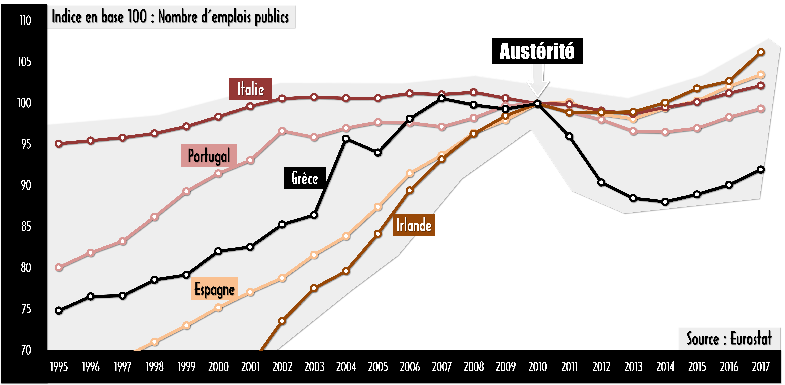

# Episode 24-9 : Italie, Espagne et Portugal

## Récap de l'épisode

Classer les pays en fonction de leur niveau de développement, ici en utilisant l’indice de complexité développé par Harvard et le niveau de PIB/habitant permet déjà de mettre en avant, dans une union monétaire où les capitaux sont libres, les pays qui sont les plus exposés à un effet de panique qui les priveraient de la capacité d’investissement du secteur privé. Ici on comprend bien que la Grèce et le Portugal sont des pays à risque. L’Espagne l’est dans une moindre mesure et l’Italie encore un peu moins. L’Irlande, pour sa part, semble complètement à l’écart. Son seul problème c’est d’être un petit pays, donc un pays facile à éviter si besoin.

Finalement on peut résumer la situation au travers d’un tableau. L’attractivité économique des différents pays du sud est un premier moyen d’expliquer la fuite des capitaux. Ensuite, vient le rôle de la bulle de l’immobilier. L’Espagne et l’Irlande ont été les deux seules victimes. Côté austérité, tous les pays ont souffert, mais force est de constater que c’est la Grèce qui a dû mettre en place les réformes les plus drastiques. En additionnant tout ça, on peut à peu près comprendre l’impact de la crise sur les taux de chômage dans les pays du sud.

Maintenant je vais essayer de résumer rapidement ce qui s’est passé dans chacun de ces pays.

En Grèce, le pays est coupé des marchés financier en premier parce que la situation financière de son gouvernement est la pire de toute la zone euro. Les mesures d’austérité, trop importantes dès le début font l’inverse de ce qui était attendu, le pays s’enfonce dans la récession, les marchés financiers ne changent pas d’avis quant au financement de l’état Grec et la Troika se retrouve obligée de supporter presque l’ensemble de la dette du pays. D’où la nécessité d’une aide massive de plusieurs centaines de milliards d’euros.

Source : Eurostat **Employment by A*10 industry breakdowns** [Lien](http://appsso.eurostat.ec.europa.eu/nui/submitViewTableAction.do)

Commentaire : Eurostat ne fait pas la distinction entre emplois publics et privés et se contente de faire un classement par secteur. Mon graphique tient compte des catégories suivantes : **ADMINISTRATION PUBLIQUE, SANTÉ HUMAINE ET ACTION SOCIALE, ENSEIGNEMENT**. Mon graphique considère donc que tous les emplois dans ces secteurs sont publics. Pourtant, il existe des hopitaux privés, des écoles privés etc. La conclusion que je tire : "Les emplois publics n'ont pas diminué sauf en Grèce" me semble justifier car la majorité des emplois dans ces secteurs sont probablement publics. Cela dit, je n'ai pas vérifié si c'était effectivement le cas dans les tous les pays européens.

